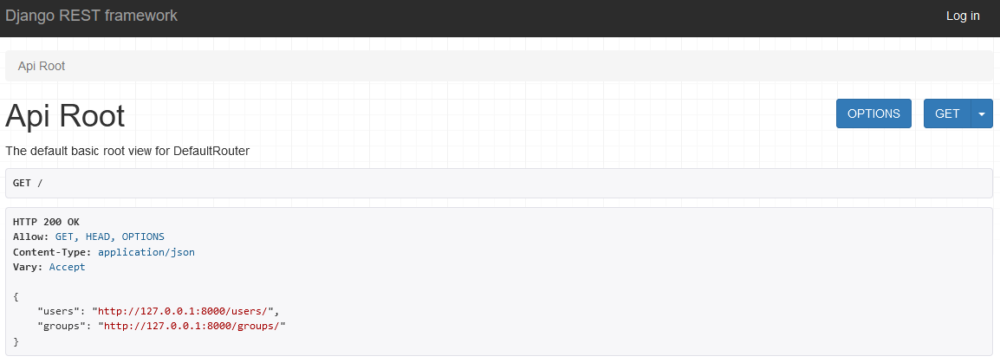

> **Note**
>
> This a is a write up of the process described [here](https://www.youtube.com/watch?v=31R1gSvBn1g&list=PLPSM8rIid1a0SMqmFOfoHRbyfQ5ipQX79) by Legion Script. Notes will be on my understanding rather than following one to one and in short organised bullets when possible.

----

## Contents

### [1. Startup](#startup)
> #### [1.1 Set up the virtual environment](#set-up-the-virtual-environment)
> #### [1.2 Basic installations](#basic-installations)
>#### [1.3 Creating the folder structure and boilerplate](#creating-the-folder-structure-and-boilerplate)

### [2. Creating the API](#creating-the-api)
>#### [2.1 Serializers](#serializers)
>#### [2.2 URLs](#urls)

-----

## Startup

### Set up the virtual environment

- Create a python virtual enviroment and activate

`python -m venv /path/`

- and then activate with 

`/path to virtual environment folder/Scripts/activate(.bat)`

----

### Basic installations

- The project comes with `Python` and `pip` but we also need `django` and `djangorest-framework`.

`pip install django djangorest-framework`

----

#### Creating the folder structure and boilerplate

- In the destination folder for the project run the command

`django-admin startproject (name)`

- and 

`django-admin startapp (name)`

- navigate to the folder of the project and initialise the database

`./manage.py migrate` 

- and then create a superuser to managa the project with 

`./manage.py createsuperuser`

----

## Creating the API

### Serializers

- Create a `serializers.py` file in the app folder
- Import your models from `django.contrib.auth.models
- Import `serialisers` from `rest-framework`
- Create serializers from models
```py
    class modelSerializer(serializers,HyperlinkedModelSerializers)
        class Meta
            model = Model
            fields['field1', 'field2', 'etc etc']
```

> **Note**
>
> Hyperlinked uses url instead of primary key

----

### ViewSets 

> **Note**
>
> Use ViewSets to reduce code.

- Create a ViewSet for each model

```py
class ModelViewSet(viewsets.ModelViewSet):
    queryset = Model.objects.all().order_by('-default chosen')
    serializer_class = ModelSerializer
    permission_classes = [permissions.IsAuthenticated]
```

----

### URLs 

- Import `path`, `include` from `django.urls`
- Import `router` from `rest-framework`
- Import your views from views folder previously used
- Create a router 

`router = routers.DefaultRouter()`

- Add ViewSets to router

`router.register(r'model', views.ModelViewSet)`

- Delete or coment out the `admin` path
- Add root path and browsable path to the url_patterns

```py 
urlpatterns = [
    # path("admin/", admin.site.urls),
    path("", include(router.urls)),
    path('api-auth/', include('rest_framework.urls', namespace='rest_framework'))
]
```

----
### Testing the server
### Starting the server

- use the command 

`python ./manage.py runserver`

